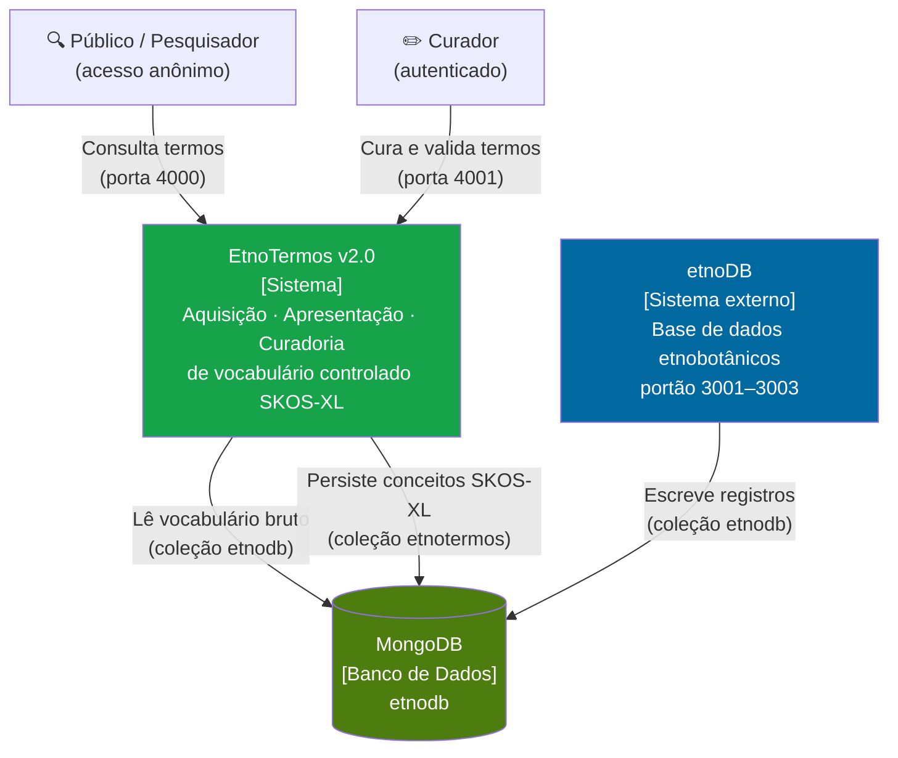
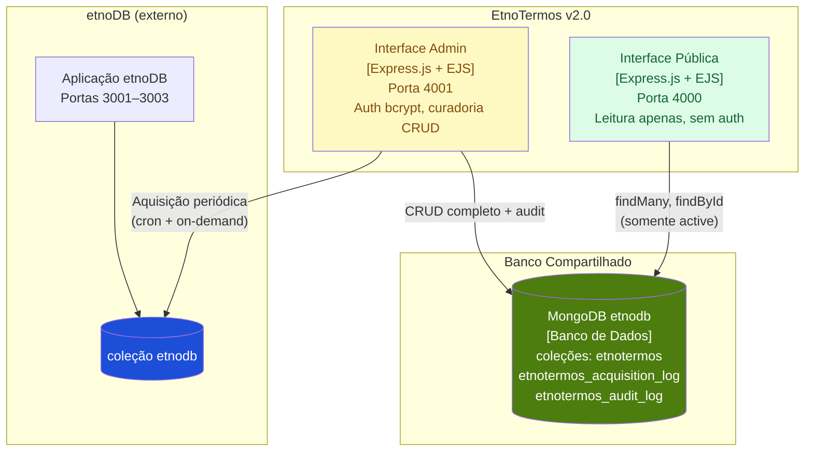
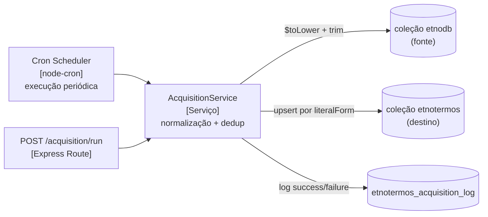
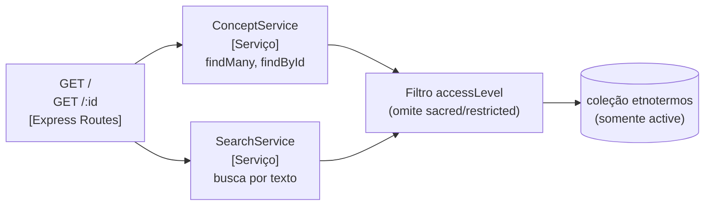
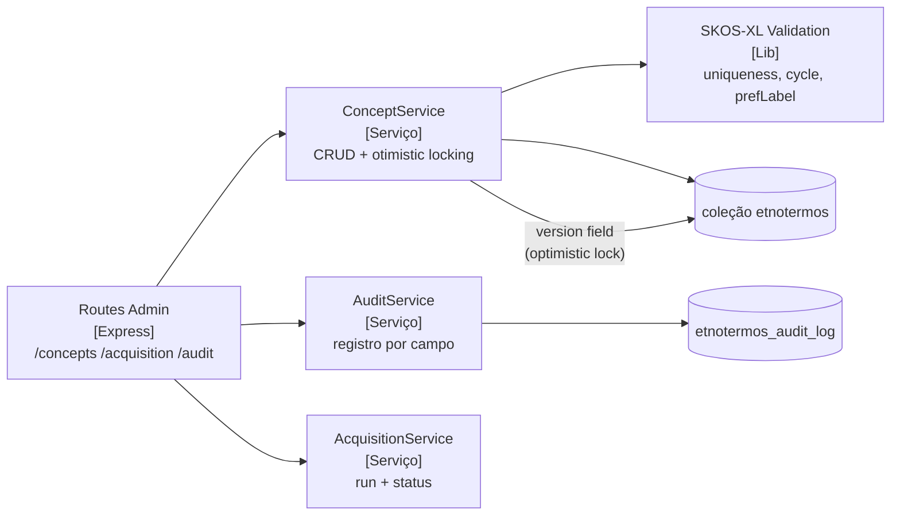
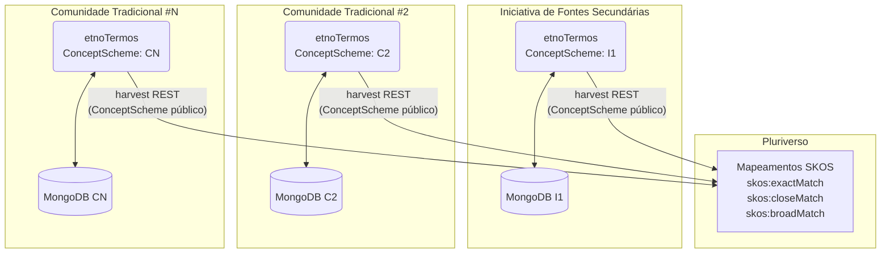

# EtnoTermos — Plataforma de Curadoria de Vocabulário Controlado Etnobotânico
## Versão 2.0

<div align="center">
  
</div>

**EtnoTermos v2.0** é um sistema integrado ao [etnoDB](https://github.com/edalcin/etnoDB) para aquisição, apresentação e curadoria de vocabulário controlado etnobotânico, operando sob o padrão **SKOS-XL** (Simple Knowledge Organization System — eXtension for Labels).

> **Padrão**: [W3C SKOS-XL](https://www.w3.org/TR/skos-reference/skos-xl.html) · [Especificação SKOS completa](docs/simple_knowledge_organization_system_skos.pdf)

---

## Motivação

O conhecimento das comunidades tradicionais do Brasil expressa relações profundas entre povos, línguas e entidades biológicas. Preservar esse conhecimento de forma legítima exige uma arquitetura de informação que não seja colonizadora — que trate os termos das línguas indígenas como protagonistas, não como apêndices subordinados à nomenclatura científica ocidental.

O EtnoTermos nasce desta necessidade: gerenciar os termos que o [etnoDB](https://github.com/edalcin/etnoDB) acumula diretamente na literatura científica, submetendo-os a um processo estruturado de curadoria segundo o padrão SKOS-XL, com governança de dados alinhada aos Princípios CARE.

---

## Por que SKOS-XL (e não ANSI/NISO Z39.19)

A versão 1.0 seguia o padrão ANSI/NISO Z39.19-2005, concebido para vocabulários monolíngues. Para o conhecimento tradicional associado à biodiversidade, esse padrão apresenta limitações estruturais críticas:

### Rótulos como objetos de primeira classe

No SKOS padrão (e no Z39.19), rótulos são literais de texto simples:

```turtle
skos:prefLabel "Ayahuasca"@pt
skos:altLabel  "Nixi Pae"@hux
```

Não é possível anotar esses rótulos. Não dá para registrar *de qual povo vem "Nixi Pae"*, *qual a ortografia validada*, ou *qual o nível de acesso* a esse conhecimento.

O **SKOS-XL** resolve isso transformando cada rótulo em um recurso RDF próprio:

```turtle
ex:label_nixi_pae a skosxl:Label ;
    skosxl:literalForm "Nixi Pae"@hux ;
    ex:sourcePeople    "Huni Kuĩ (Kaxinawá)" ;
    ex:sourceRegion    "Alto Juruá, Acre" ;
    ex:accessLevel     "public" ;
    ex:audioPath       "/audio/nixi-pae-huni-kui.mp3" ;
    ex:validatedBy     "ASKARJ" .
```

### Multiplicidade linguística real

Termos como *ayahuasca*, *cipó-mariri*, *nixi pae*, *daime* e *hoasca* são rótulos do **mesmo conceito**, mas cada um carrega origem étnica, língua e contexto cerimonial distintos. Com SKOS-XL, cada rótulo recebe atribuição própria — o que era impossível com literais simples.

### Controle de acesso por rótulo (Princípios CARE)

O SKOS-XL permite definir `accessLevel` individualmente por rótulo:

- **`public`** — aberto para consulta na internet
- **`restricted`** — visível apenas a pesquisadores autorizados (SisGen/comunidade)
- **`sacred`** — visível apenas aos membros da comunidade detentora

Isso implementa diretamente o princípio **Authority to Control** do CARE: a comunidade decide qual denominação do seu conhecimento pode ser divulgada e em que nível.

### Relações entre rótulos (labelRelation)

`skosxl:labelRelation` permite modelar relações etimológicas e de origem entre denominações:

```turtle
ex:label_jurema_pt skosxl:labelRelation ex:label_jurema_kariri .
# O rótulo em Tupí/Kariri é a forma de origem; o português é empréstimo.
```

### Interoperabilidade Darwin Core e JSON-LD

`dwc:vernacularName` pode ser mapeado para `skosxl:Label`, permitindo que nomes vernáculos tenham a riqueza de anotação do XL e sejam consumidos por GBIF, WFO e outras infraestruturas de biodiversidade via JSON-LD.

---

## Por que MongoDB

O MongoDB é a escolha técnica mais adequada para a natureza plural e dinâmica deste domínio:

### Pluralismo taxonômico

Em vez de tabelas rígidas, um único documento pode conter simultaneamente a classificação ocidental e múltiplas etnotaxonomias, sem que um esquema interfira no outro.

### Modelagem dinâmica de línguas indígenas

O modelo de documentos BSON/JSON permite que atributos variem entre registros. Línguas com arquivos de áudio, notas rituais ou variações ortográficas coexistem com registros mais simples — sem penalidade de esquema.

### Compatibilidade com JSON-LD

O MongoDB armazena documentos JSON nativamente, permitindo guardar e consultar estruturas JSON-LD diretamente — facilitando a interoperabilidade com padrões de Web Semântica.

### Hierarquias com Array of Ancestors

Para representar hierarquias de etnotaxonomias, o padrão *Array of Ancestors* armazena toda a cadeia de ancestrais no documento. Isso permite descobrir a linha hierárquica completa de um conceito com uma única consulta, sem recursividade custosa em tempo de execução.

```json
{
  "uri": "etnotermos:plantas-medicinais/jatoba",
  "prefLabels": [{ "literalForm": "jatobá", "language": "pt", "accessLevel": "public" }],
  "broader": ["<id-plantas-medicinais>"],
  "ancestors": ["<id-plantas-medicinais>", "<id-usos-tradicionais>"]
}
```

### $graphLookup para travessias complexas

O operador `$graphLookup` do MongoDB permite navegação recursiva em grafos de relacionamentos — útil para consultas como *"todos os conceitos relacionados ao uso medicinal que possuem rótulo em língua indígena"*.

---

## Integração com etnoDB

O EtnoTermos e o [etnoDB](https://github.com/edalcin/etnoDB) compartilham banco de dados, identidade visual e vocabulário:

| Aspecto | Detalhe |
|---|---|
| **Database** | MongoDB `etnodb` (instância compartilhada) |
| **Coleção etnotermos** | `etnotermos` (separada de `etnodb`) |
| **Coleção fonte** | `etnodb` (lida pelo contexto de Aquisição) |
| **Campos gerenciados** | `comunidades.tipo`, `comunidades.plantas.nomeVernacular`, `comunidades.plantas.tipoUso`, `comunidades.atividadesEconomicas` |
| **Identidade visual** | Tema `forest` (Tailwind CSS) — mesmas cores, fontes, componentes |

O etnoDB coleta dados secundários de artigos científicos. O EtnoTermos consome esses dados automaticamente via contexto de Aquisição, transformando valores brutos em conceitos SKOS-XL candidatos. Os curadores então elevam, relacionam e enriquecem esses conceitos via interface de Curadoria.

---

## Arquitetura — C4 Model

### Nível 1 — Contexto do Sistema



### Nível 2 — Containers



### Nível 3 — Componentes

#### Contexto de Aquisição (dentro do Admin)



#### Contexto de Apresentação (porta 4000)



#### Contexto de Curadoria (porta 4001)



---

## Modelo de Conceito SKOS-XL

```json
{
  "_id": "ObjectId",
  "uri": "etnotermos:tipo-comunidade/indigena",
  "status": "candidate | active | deprecated",
  "sourceFields": ["comunidades.tipo"],
  "prefLabels": [
    {
      "_id": "ObjectId",
      "literalForm": "indígena",
      "language": "pt",
      "type": "pref",
      "accessLevel": "public | restricted | sacred",
      "audioPath": null,
      "labelRelations": [],
      "createdAt": "ISODate",
      "updatedAt": "ISODate"
    }
  ],
  "altLabels": [],
  "hiddenLabels": [],
  "definition": "",
  "scopeNote": "",
  "historyNote": "",
  "broader": ["ObjectId"],
  "narrower": ["ObjectId"],
  "related": ["ObjectId"],
  "ancestors": ["ObjectId"],
  "replacedBy": null,
  "version": 1,
  "createdAt": "ISODate",
  "updatedAt": "ISODate"
}
```

**Destaques do modelo:**
- `prefLabels[]` — rótulos como objetos (SKOS-XL), não literais
- `accessLevel` por rótulo — governa visibilidade individual (Princípios CARE)
- `ancestors[]` — Array of Ancestors para O(1) em consultas hierárquicas
- `version` — campo de otimistic locking (conflito → HTTP 409)
- `status: candidate` — todo conceito recém-adquirido aguarda curadoria

---

## Portas e Perfis de Acesso

| Contexto | Porta | Auth | Capacidades |
|---|---|---|---|
| Apresentação | 4000 | Nenhuma | Listar e buscar conceitos `active`; omite rótulos `sacred`/`restricted` |
| Curadoria | 4001 | bcrypt (basic auth) | CRUD completo, aquisição, trilha de auditoria, deprecação |

---

## Stack Tecnológica

- **Backend**: Node.js 20 LTS + Express.js + MongoDB Driver 6.x
- **Frontend**: HTMX 2.x + Alpine.js 3.x + Tailwind CSS 3.x (tema `forest`, idêntico ao etnoDB)
- **Template Engine**: EJS (server-side rendering)
- **Banco de Dados**: MongoDB 7.0+, database `etnodb`
- **Visualização**: Cytoscape.js (grafos de relacionamentos)
- **Testes**: Jest + Supertest + mongodb-memory-server
- **Deploy**: Docker (Alpine Linux)

---

## Instalação e Desenvolvimento

```bash
# Backend
cd backend
npm install
npm run dev:public    # Interface pública  — porta 4000
npm run dev:admin     # Interface admin    — porta 4001
npm test

# Frontend (build CSS Tailwind)
cd frontend
npm install
npm run build:css     # Build CSS
npm run watch:css     # Watch mode
```

### Configuração de autenticação admin

**Opção A — simples** (desenvolvimento e UNRAID):

```env
ADMIN_USERNAME=curador1
ADMIN_PASSWORD=sua_senha
```

O sistema faz o hash bcrypt automaticamente na inicialização.

**Opção B — produção** (múltiplos usuários, hash pré-gerado):

```env
ADMIN_USERS=[{"username":"curador1","passwordHash":"$2b$10$..."}]
```

Gerar o hash: `node -e "import('bcrypt').then(m=>m.default.hash('senha',10).then(console.log))"`

Ou use o script interativo: `node docker/create-admin-user.js`

### Docker

```bash
# Configurar (interativo — pede usuário, senha e URI do MongoDB)
node docker/create-admin-user.js

# Iniciar
docker-compose -f docker/docker-compose.yml up -d
```

Documentação detalhada:
- [Desenvolvimento local](docs/desenvolvimento.md)
- [Deployment em produção](docs/deployment.md)
- [Instalação no UNRAID](docs/instalacao-unraid.md)

---

## Princípios CARE

O EtnoTermos implementa os Princípios CARE para dados de povos indígenas:

| Princípio | Implementação |
|---|---|
| **C**ollective Benefit | Vocabulário gerenciado pelas próprias comunidades via interface de curadoria |
| **A**uthority to Control | `accessLevel` por rótulo: `public`, `restricted`, `sacred` |
| **R**esponsibility | Trilha de auditoria completa por campo e por responsável |
| **E**thics | Aquisição não-invasiva (leitura de dados já publicados no etnoDB) |

---

## Referências e Padrões

- [W3C SKOS-XL](https://www.w3.org/TR/skos-reference/skos-xl.html) — Simple Knowledge Organization System eXtension for Labels
- [Especificação SKOS (PDF)](docs/simple_knowledge_organization_system_skos.pdf) — Referência completa
- [Princípios CARE](https://www.gida-global.org/care) — Governança de dados indígenas
- [Darwin Core](https://dwc.tdwg.org/) — Interoperabilidade com biodiversidade
- [Protocolo de Nagoya](https://www.cbd.int/abs/) — Repartição de benefícios
- [etnoArquitetura](https://github.com/edalcin/etnoArquitetura) — Ecossistema integrado
- [etnoDB](https://github.com/edalcin/etnoDB) — Sistema fonte de dados etnobotânicos

## EtnoArquitetura Federada — v3.0

O **etnoTermos** faz parte da [EtnoArquitetura](https://github.com/edalcin/etnoArquitetura), um ecossistema federado para gestão de Conhecimento Tradicional Associado à Biodiversidade (CTA). Na versão 3.0, o etnoTermos assume um papel central e diferente da versão anterior.

### Papel do etnoTermos na Federação

Na arquitetura federada v3.0, **cada membro opera sua própria instância soberana do etnoTermos** com seu próprio `skos:ConceptScheme`. O etnoTermos deixa de ser uma infraestrutura terminológica central compartilhada e passa a ser um componente **por membro** — garantindo o princípio **Authority to Control** do CARE: cada comunidade ou iniciativa é dona de seus próprios vocabulários.



O **Pluriverso** mantém uma camada de mapeamentos semânticos (`skos:exactMatch`, `skos:closeMatch`, `skos:broadMatch`) entre os `ConceptScheme` de diferentes membros. Isso permite que uma busca semântica federada encontre registros independentemente de qual termo cada membro usa para o mesmo conceito.

### Soberania dos Vocabulários

- **Cada membro** mantém autoridade total sobre seus conceitos, rótulos (`skosxl:prefLabel`, `skosxl:altLabel`) e relações
- **Nenhum membro** pode alterar o vocabulário de outro
- **O Pluriverso** propõe mapeamentos; o Comitê Federado os aprova — nunca são impostos
- **Saída da federação**: ao sair, todos os mapeamentos envolvendo os conceitos desse membro são removidos do Pluriverso

### Mudanças Necessárias para v3.0

> **Nota**: Nenhuma implementação está sendo realizada agora.

| Mudança | Descrição |
|---------|-----------|
| **Endpoint de harvest de ConceptScheme** | Implementar `GET /api/federation/concepts` retornando os conceitos públicos do `ConceptScheme` do membro, para coleta pelo Pluriverso |
| **Campo `member_id`** | Cada conceito e rótulo deve carregar `member_id` para rastreabilidade nos mapeamentos federados |
| **Isolamento de instância** | Garantir que cada instância é completamente independente (sem dependência de outras instâncias via rede) |
| **Nível de acesso por conceito** | Suporte a `accessLevel` por conceito além de por rótulo (alguns conceitos podem ser `restricted` ou `sacred` na totalidade) |

### Componentes Relacionados

| Componente | Relação |
|------------|---------|
| **[etnoDB](https://github.com/edalcin/etnoDB)** | A instância da Iniciativa #1 do etnoTermos serve ao etnoDB como infraestrutura terminológica |
| **[etnoRelatos](https://github.com/edalcin/etnoRelatos)** | Cada Comunidade Tradicional opera sua própria instância do etnoTermos integrada ao seu etnoRelatos |
| **[Pluriverso](https://github.com/edalcin/pluriverso)** | Coleta ConceptSchemes públicos e mantém mapeamentos SKOS entre membros |
| **[etnoArquitetura](https://github.com/edalcin/etnoArquitetura)** | Documentação completa ([ADR-004](https://github.com/edalcin/etnoArquitetura/blob/main/docs/architecture-decisions/ADR-004-federated-architecture.md)) |

---

**Status**: v2.0 em desenvolvimento ativo

**Licença**: A definir

**Contato**: [GitHub Issues](https://github.com/edalcin/etnotermos/issues) · edalcin@jbrj.gov.br
